> Nama : Julita Hasanah  

> Nim : 2110131120005

  

<h1 align="center"><b>SISTEM OPERASI</b></h1> 

Sistem Operasi merupakan sebuah perangkat lunak yang "membungkus" perangkat keras agar lebih mudah dimanfaatkan oleh para pengguna melalui program-program aplikasi tersebut.   
Sistem Operasi bertugas untuk mengendalikan (kontrol) serta mengkoordinasikan pengunaan perangkat keras untuk berbagai program aplikasi untuk bermacam-macam pengguna.  

## **Komponen Sistem Operasi**

Sebuah sistem operasi dapat dibagi menjadi beberapa komponen. Secara umum, para pakar sepakat bahwa terdapat sekurangnya empat komponen manajeman utama yaitu:

- Manajemen Proses,
- Manajemen Memori, dan
- Manajamen Sistem Berkas.
- Manajemen Masukan/Keluaran

Selain keempat komponen di atas, Avi Silberschatz, dan kawan-kawan menambahkan beberapa komponen seperti:

- Manajemen Penyimpanan Sekunder.
- Manajemen Sistem Proteksi.
- Manajemen Jaringan.
- Command-Interpreter System.

 

### **Manajemen Proses**

Proses adalah keadaan ketika sebuah program sedang di eksekusi. Sebuah proses membutuhkan beberapa sumber daya untuk menyelesaikan tugasnya. sumber daya tersebut dapat berupa CPU time, memori, berkas-berkas, dan perangkat-perangkat I/O. Sistem operasi bertanggung jawab atas aktivitas-aktivitas yang berkaitan dengan managemen proses seperti:

- Pembuatan dan penghapusan proses pengguna dan sistem proses.
- Menunda atau melanjutkan proses.
- Menyediakan mekanisme untuk proses sinkronisasi.
- Menyediakan mekanisme untuk proses komunikasi.
- Menyediakan mekanisme untuk penanganan deadlock.

 

### **Manajemen Memori Utama**

Memori utama atau lebih dikenal sebagai memori adalah sebuah array yang besar dari word atau byte, yang ukurannya mencapai ratusan, ribuan, atau bahkan jutaan. Setiap word atau byte mempunyai alamat tersendiri. Memori Utama berfungsi sebagai tempat penyimpanan yang akses datanya digunakan oleh CPU atau perangkat I/O. Memori utama termasuk tempat penyimpanan data yang sementara (volatile), artinya data dapat hilang begitu sistem dimatikan. Sistem operasi bertanggung jawab atas aktivitas-aktivitas yang berkaitan dengan managemen memori seperti:

- Menjaga track dari memori yang sedang digunakan dan siapa yang menggunakannya.
- Memilih program yang akan di-load ke memori.
- Mengalokasikan dan meng-dealokasikan ruang memori sesuai kebutuhan.

 

### **Manajemen Sistem Berkas**

Berkas adalah kumpulan informasi yang berhubungan sesuai dengan tujuan pembuat berkas tersebut. Berkas dapat mempunyai struktur yang bersifat hirarkis (direktori, volume, dll.). Sistem operasi bertanggung-jawab:

- Pembuatan dan penghapusan berkas.
- Pembuatan dan penghapusan direktori.
- Mendukung manipulasi berkas dan direktori.
- Memetakan berkas ke secondary storage.
- Mem-backup berkas ke media penyimpanan yang permanen (non-volatile).

 

### **Manajemen Sistem Masukan/Keluaran**

Sistem ini sering disebut dengan device manager. Menyediakan device driver yang umum sehingga operasi Masukan/Keluaran dapat seragam (membuka, membaca, menulis, menutup). Contoh: pengguna menggunakan operasi yang sama untuk membaca berkas pada perangkat keras, CD-ROM dan floppy disk. 

Komponen Sistem Operasi untuk sistem Masukan/Keluaran:

- Penyangga: menampung sementara data dari/ke perangkat Masukan/Keluaran.
- Spooling: melakukan penjadwalan pemakaian Masukan/Keluaran sistem supaya lebih efisien (antrian dsb.).
- Menyediakan driver: untuk dapat melakukan operasi rinci untuk perangkat keras Masukan/Keluaran tertentu.

 

### **Manajemen Penyimpanan Sekunder**

Data yang disimpan dalam memori utama bersifat sementara dan jumlahnya sangat kecil. Oleh karena itu, untuk menyimpan keseluruhan data dan program komputer dibutuhkan penyimpanan sekunder yang bersifat permanen dan mampu menampung banyak data, sebagai back-up dari memori utama. Contoh dari penyimpanan sekunder adalah hard-disk, disket, dll. 

Sistem operasi bertanggung-jawab atas aktivitas-aktivitas yang berkaitan dengan manajemen disk seperti:

- free space management.
- alokasi penyimpanan.
- penjadwalan disk.

 

### **Sistem Proteksi**

Proteksi mengacu pada mekanisme untuk mengontrol akses yang dilakukan oleh program, prosesor, atau pengguna ke sistem sumber daya. Mekanisme proteksi harus: 

- Membedakan antara penggunaan yang sudah diberi izin dan yang belum.
- Menspesifikasi kontrol untuk dibebankan/diberi tugas.
- Menyediakan alat untuk pemberlakuan sistem.

 

### **Jaringan**

Sistem terdistribusi adalah sekumpulan prosesor yang tidak berbagi memori atau clock. Tiap prosesor mempunyai memori sendiri. Prosesor-prosesor tersebut terhubung melalui jaringan komunikasi Sistem terdistribusi menyediakan akses pengguna ke bermacam sumber-daya sistem. Akses tersebut menyebabkan:

- Computation speed-up.
- Increased data availability.
- Enhanced reliability.

 

### **Command Interpreter System**

Sistem Operasi menunggu instruksi dari pengguna (command driven). Program yang membaca instruksi dan mengartikan control statements umumnya disebut: control-card interpreter, command-line interpreter dan terkadang dikenal sebagai shell. 
Command-Interpreter System sangat bervariasi dari satu sistem operasi ke sistem operasi yang lain dan disesuaikan dengan tujuan dan teknologi perangkat Masukan/Keluaran yang ada. Contohnya: CLI, Windows, Pen-based (touch), dan lain-lain.

  

### **Contoh Komponen Sistem operasi**

- **Manajemen Proses**  

  - 
Menyediakan mekanisme untuk proses sinkronisasi. Sistem operasi akan mengatur jalanya beberapa proses yang dieksekusi bersamaan, tujuanya menghidarkan terjadinya inkonsistensi.Contohnya yaitu ketika kita membuka beberapa aplikasi tertentu pada perangkat komputer secara bersamaan dalam satu waktu maka sistem operasi akan mengatur jalanya proses agar setiap proses berjalan dengan lancar. Utuk lebih jelasnya dapat dilihat contoh penerapannya di bawah ini!  
    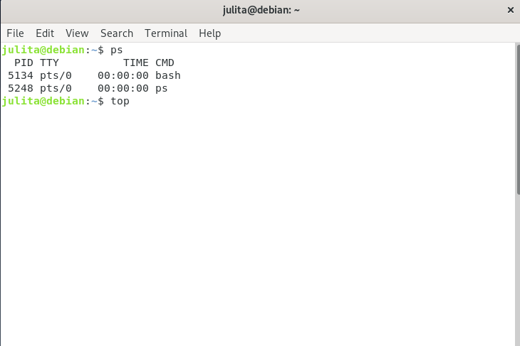 
    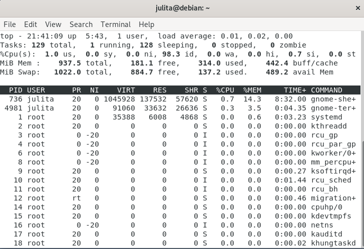 
    Untuk melihat status aplikasi/fitur yang sedang berjalan itu apa saja yaitu jika pada windows di task manager lalu pada proses, berbeda dengan linux yaitu pada terminal lalu menggunakan perintah ps atau top. Perbedaannya adalah top lebih sering digunakan secara interaktif dan ps lebih sering digunakan dalam script, digabungkan dengan perintah bash lainnya atau yang serupa.  
    Perintah top digunakan untuk menampilkan proses teratas yang biasanya mengkonsumsi resource sistem yang paling besar.
    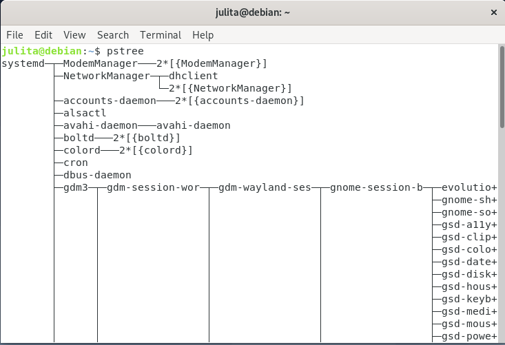 
    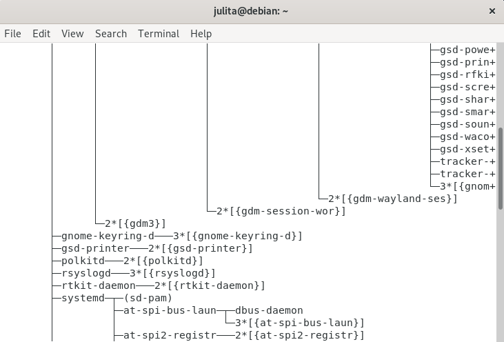 
    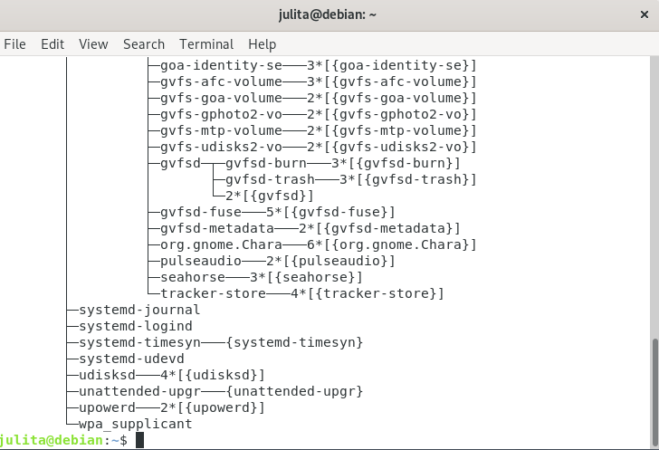 
    pstree ini seperti pohon akar, yaitu menampilkan proses yang sedang berjalan dalam bentuk pohon.

 

- **Manajemen Sistem Berkas** 

  - Membuat folder 
    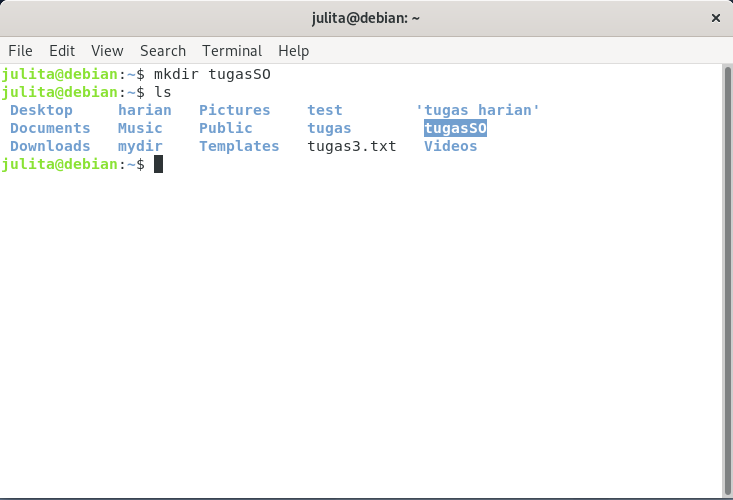 
    Untuk membuat folder menggunakan perintah mkdir _ nama folder _ . ls adalah perintah yang digunakan untuk melihat direktori pada linux. 

  - Membuat folder dalam folder 
    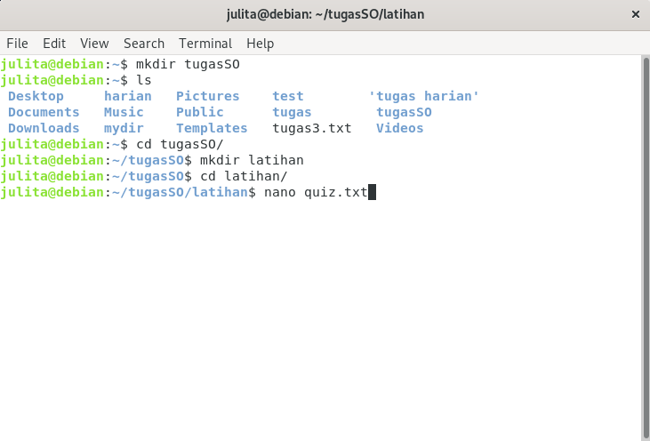 

    - Untuk menggunakan atau mengisi folder yang sudah di baut tadi amak emnggunakan perintah cd _ nama folder _
    - untuk membuat file menggunakan perintah nano _ nama file _ lalu tekan enter. Perintah nano merupakan text editor berbasis text 

    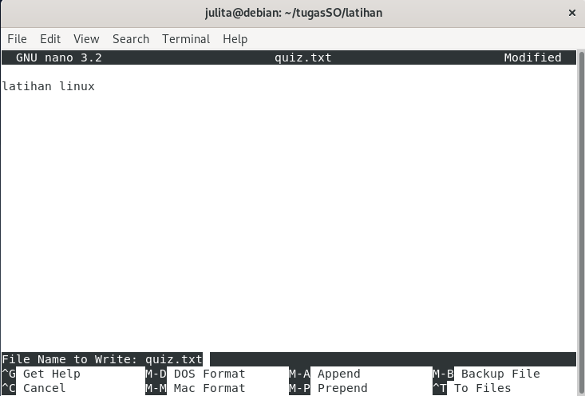 

    - Isi file txt, kemudian "ctrl+x" klik lalu klik "y" untuk menyimpan file 

    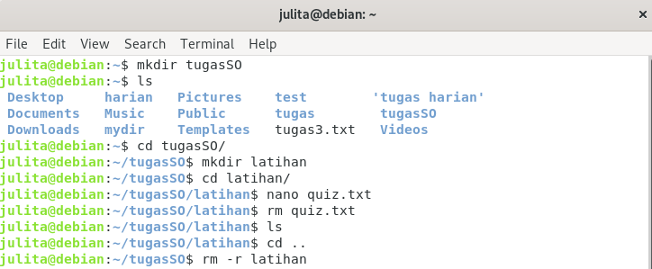 

    - Untuk mengapus file menggunakan perintah rm _ nama file _  
    - Untuk mengapus folder beserta isinya menggunakan perintah rm -r _ nama folder _  

 

- **Manajemen Masukan/Keluaran (pada linux)**
  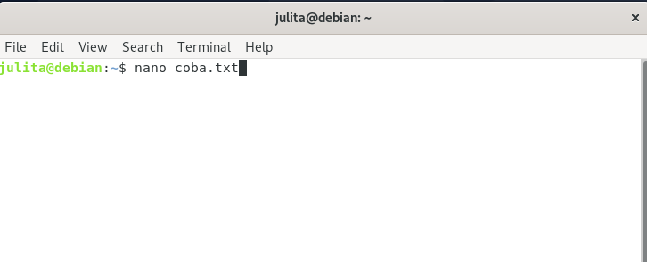 
  Membuat program pada linux yaitu ketikkan pada terminal linux yaitu nano _ nama file _ .txt (ekstensi opsional) 
  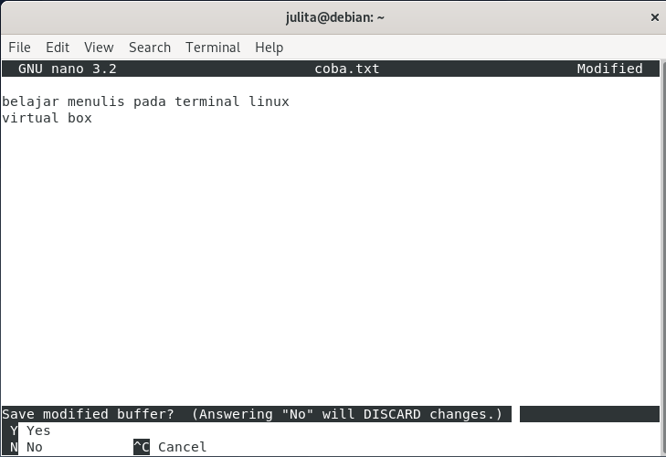 
  Ketikkan isi program pada terminal. Kemudian untuk menyimpan file yaitu klik "ctrl+x" lalu ketik "y"
  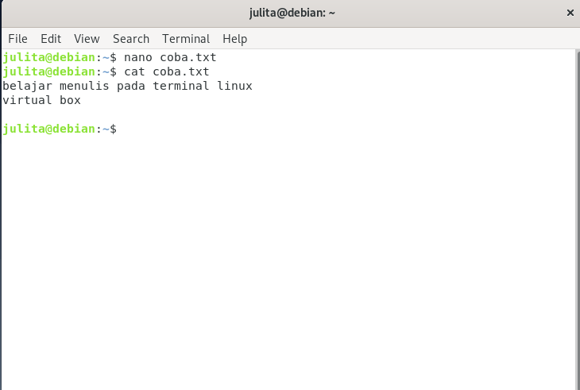 
  Untuk melihat program yang sudah dibuat maka pada terminal ketik "cat _ namafile _ lalu klik enter.   

    

## **Layanan Sistem Operasi**

Layanan sistem operasi dirancang untuk membuat pemrograman menjadi lebih mudah.

1. 
Pembuatan Program: Sistem operasi menyediakan berbagai fasilitas yang membantu programer dalam membuat program seperti editor. Walaupun bukan bagian dari sistem operasi, tapi layanan ini diakses melalui sistem operasi. 

2. 
Eksekusi Program: Sistem harus bisa me-load program ke memori, dan menjalankan program tersebut. Program harus bisa menghentikan pengeksekusiannya baik secara normal maupun tidak (ada error). 

3. 
Operasi Masukan/Keluaran. Program yang sedang dijalankan kadang kala membutuhkan Masukan/Keluaran. Untuk efisiensi dan keamanan, pengguna biasanya tidak bisa mengatur peranti Masukan/Keluaran secara langsung, untuk itulah sistem operasi harus menyediakan mekanisme dalam melakukan operasi Masukan/Keluaran.

4. 
 Manipulasi Sistem Berkas. Program harus membaca dan menulis berkas, dan kadang kala juga harus membuat dan menghapus berkas. 

5. 
komunikasi. Kadang kala sebuah proses memerlukan informasi dari proses yang lain. Ada dua cara umum dimana komunikasi dapat dilakukan. Komunikasi dapat terjadi antara proses dalam satu komputer, atau antara proses yang berada dalam komputer yang berbeda, tetapi dihubungkan oleh jaringan komputer. Komunikasi dapat dilakukan dengan share-memory atau message-passing, dimana sejumlah informasi dipindahkan antara proses oleh sistem operasi. 

6. 
Deteksi Error. Sistem operasi harus selalu waspada terhadap kemungkinan error. Error dapat terjadi di CPU dan memori perangkat keras, Masukan/Keluaran, dan di dalam program yang dijalankan pengguna. Untuk setiap jenis error sistem operasi harus bisa mengambil langkah yang tepat untuk mempertahankan jalannya proses komputasi. Misalnya dengan menghentikan jalannya program, mencoba kembali melakukan operasi yang dijalankan, atau melaporkan kesalahan yang terjadi agar pengguna dapat mengambil langkah selanjutnya. 

 
Contoh :  

- **Pembuatan Program** 
  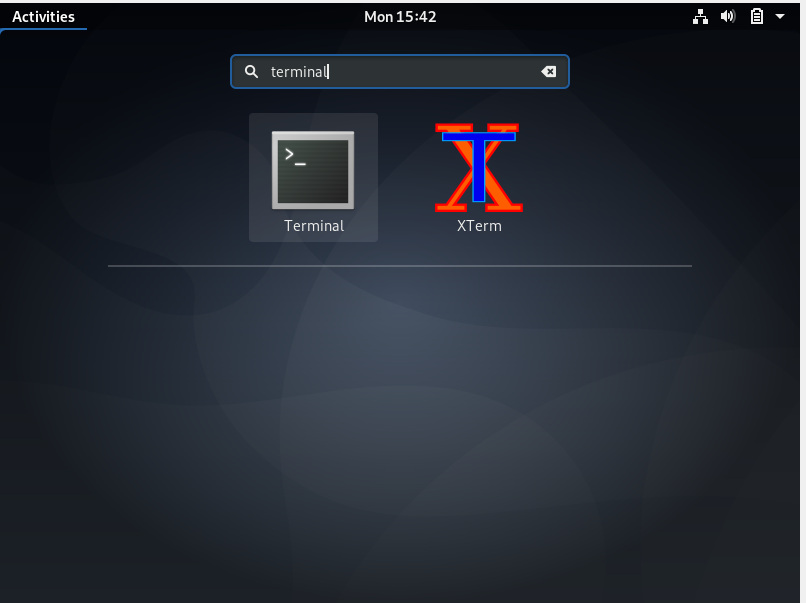 
  Disini saya menggunakan linux di virtual box, Untuk membuat program dan masuk ke dalam kode editor di linux menggunakan terminal, untuk itu pada layar linux klik activities lalu cari di pencarian "terminal" 
  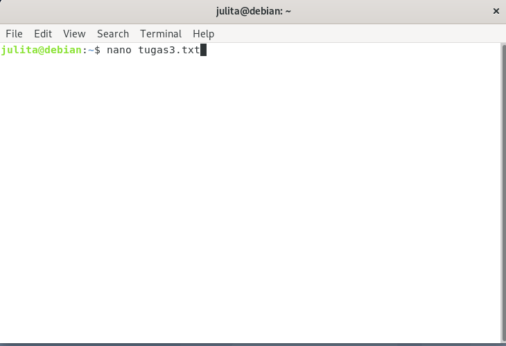 
  Membuat program pada linux yaitu ketikkan pada terminal linux yaitu nano _nama file_ .txt (ekstensi opsional) 
  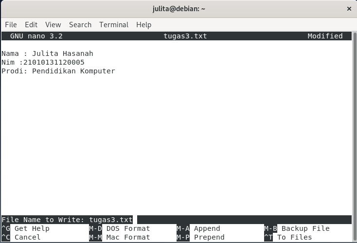 
  Ketikkan isi program pada terminal. Kemudian untuk menyimpan file yaitu klik "ctrl+x" lalu ketik "y"
   
  Untuk melihat program yang sudah dibuat maka pada terminal ketik "cat _namafile_ lalu klik enter.   

- **Operasi Masukan/Keluaran** 
  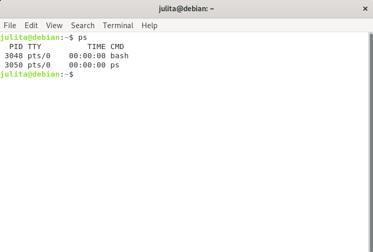 
  operasi i/o pada linux yaitu masih pada terminal. Pada gambar di atas adalah proses output kelayar dengan menggunakan "ps" pada terinal adalah yang inputnya sendiri berasal dari system(kernel).
  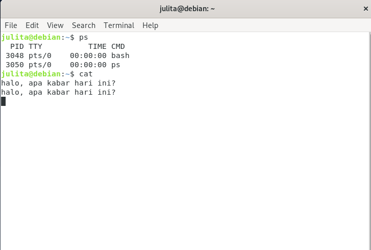 
  berbeda dengan gambar sebelumnya yang inputnya berasal dari system, gambar di atas adalah proses i/o yang inputnya berasar dari keyboard yaitu dengan menggunakan "cat"

  - klik cat pada terminal
  - lalu ketik inputan dari keyboard, contohnya "halo, apa kabar hari ini?"
  - stelah itu klik enter apa akan tampil output yang sama seperti yang sudah di inputkan tadi. 

  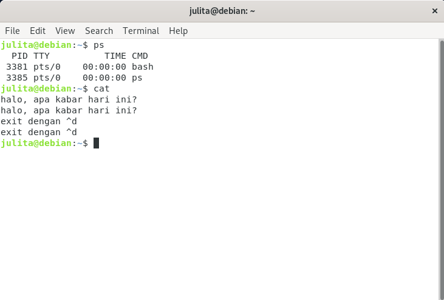 

  - Untuk keluar dari terminal input/output ini kita bisa klik pada keyboard yaitu "ctrl+d"

  

- **Deteksi Error** 
  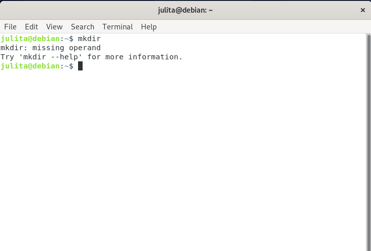 
  Pada gambar di atas terdapat pesan error, karena mkdir kemudian outputnya tidak kita tuliskan pada perintah.

  

## **System Call**

Biasanya tersedia sebagai instruksi bahasa assembly. Beberapa sistem mengizinkan system calls dibuat langsung dari program bahasa tingkat tinggi. Beberapa bahasa pemrograman (contoh: C, C++) telah didefenisikan untuk menggantikan bahasa assembly untuk sistem pemrograman.   

Tiga metode umum yang digunakan dalam memberikan parameter kepada sistem operasi:

- Melalui register.
- Menyimpan parameter dalam block atau tabel pada memori dan alamat block tersebut diberikan sebagai parameter dalam register.
- Menyimpan parameter (push) ke dalam stack oleh program, dan melakukan pop off pada stack oleh sistem operasi.

Contoh :

- **Membuat folder** 
  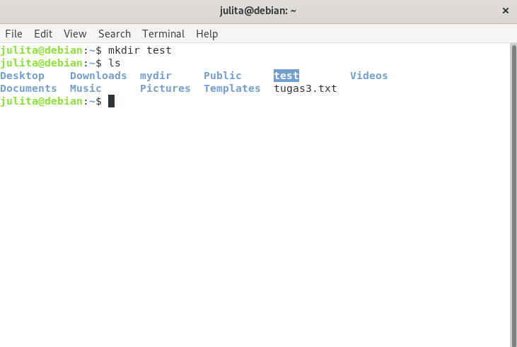 
  Masih di dalam terminal, untuk membuat folder pada linux maka menggunakan mkdir _ nama directori _ . ls adalah perintah yang digunakan untuk melihat direktori pada linux. Perintah ini digunakan untuk melihat atau menampilkan/list isi dari folder/direktori di linux. 
  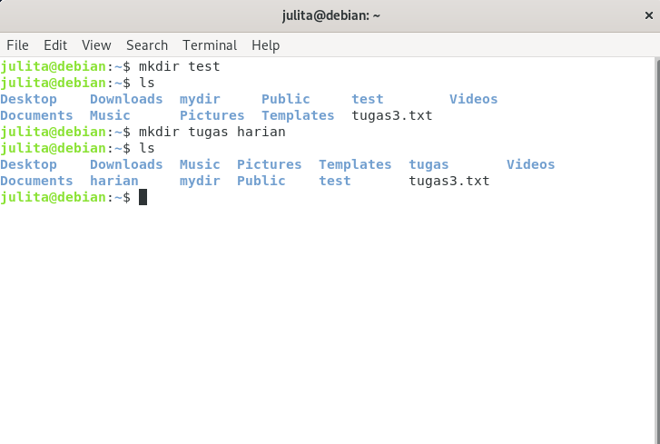 
  Jika ingin membuat beberapa folder sekaligus maka menggunakan spasi pada gambar di atas dan dapat dilihat setelah ketik perintah ls maka list direktori sudah bertambah 2 yaitu direktori tugas dan latihan.
  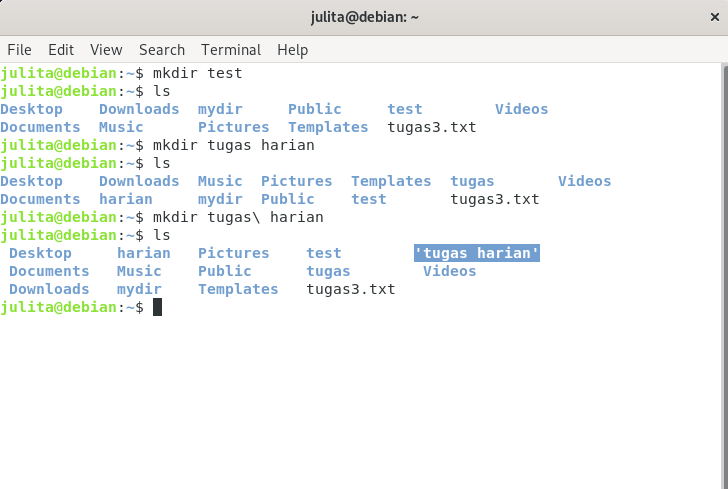 
  Namun jika ingin membuat foder dengan suku kata lebih dari satu bisa menggunakan "\"untuk pemisahnya seperti pada gambar di atas.

 

- **Membuat file** 
  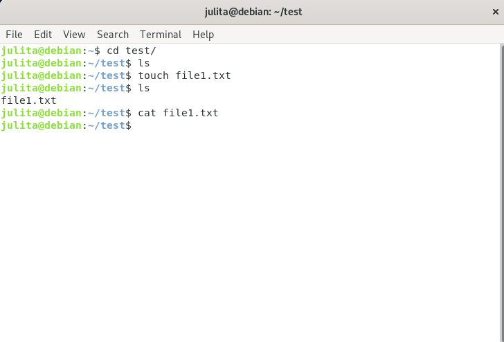 

  - Disini saya akan memgisi folder test yang sudah dibuat tadi maka untuk membuka folder tersebut menggunakan "cd _ nama folder _" dapat dilihat dengan ls folder masih kosong.  
  - Perintah touch _ nama file_ adalah perintah untuk membuat file baru yang kosong.
  - Perintah cat berfungsi untuk menampilkan isi dari file, daat terliat file masih kosong karena belum diisi apapun. 

  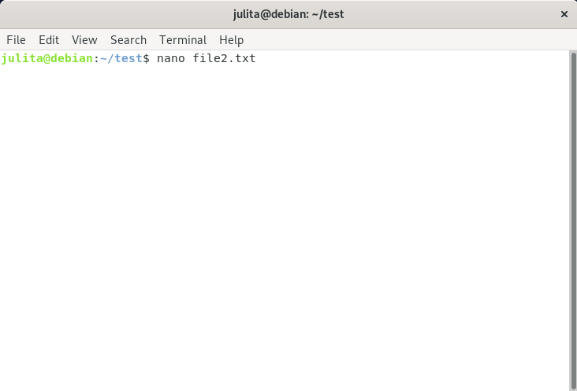 

  - Jika kita ingin membuat file beserta dengan isinya pada terminal menggunakan nano _ nama file _ lalu tekan enter. nano merupakan text editor berbasis text. 

  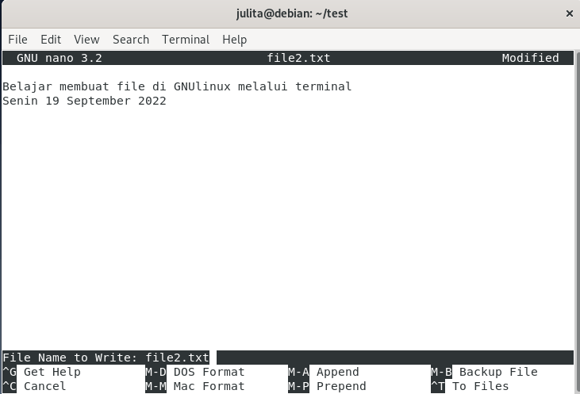 

  - Isi file txt, kemudian "ctrl+x" klik lalu klik "y" untuk menyimpan file

  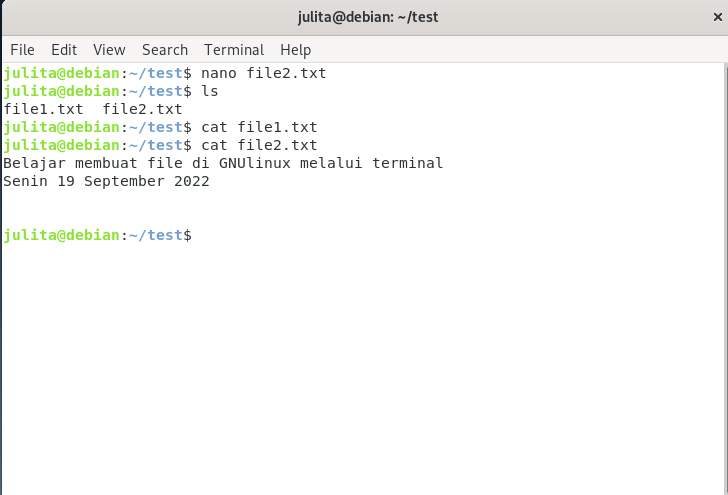 
  Untuk melihat isi folder test ketik "ls" maka dapat dilihat bahwa isi folder sudah terdapat dua file yaitu file1.txt dan file2.txt  
  cat file1.txt berfungsi untuk melihat isi dari file1.txt dapat dilihat bahwa isi dari file tersebut kosong. 
  cat file2.txt berfungsi untuk melihat isi dari file tersebut, dapat dilihat bahwa isinya "Belajar membuat file di..."

   

- **Menghapus file dan folder** 

  - Menghapus file 
    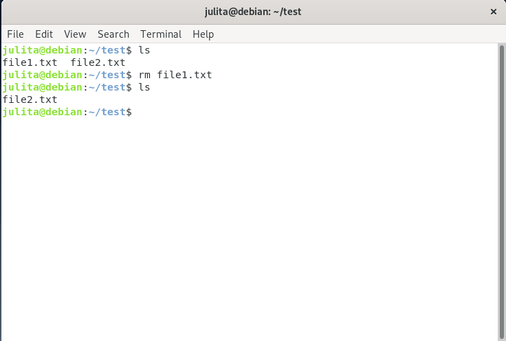 
    Untuk menghapus file maka menggunakan perintah rm _ nama file _ seperti pada gambar di atas yaitu rm file1.txt 
    Untuk melihat isi dari folder test dapat menggunakan perintah ls, dapat dilihat bahwa file1.txt sudah terhapus dari folder text 

  - Menghapus folder 
    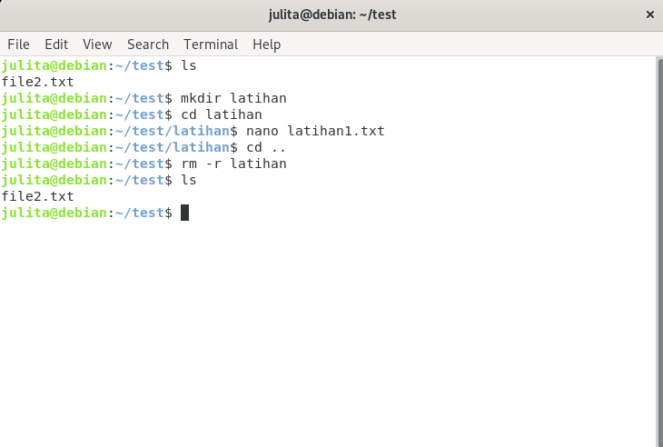 
    Masih di dalam folder test, di dalam folder ini saya buat lagi folder bernama latihan, di dalam latihan saya buat file bernama latihan1.txt  
    Kemudian untuk menghapus folder latihan beserta isi yag ada didalamnya maka menggunakan perintah rm -r _ nama folder _ . Dapat dilihat dengan peintah ls bahwa folder latihan sudah terhapus dan tidak ada lagi di folder test.   

> Keterangan :  
> Sebenarnya file tugas 3 ini sudah dikirim tepat waktu sebelum deadline, tetapi karna ada kesalahan saat mengirim file tugas 3 maka semua file yang ada pada origin master github terhapus, oleh karena ini file dikirim ulang.
> _Keterangan file dikirim ulang karena yang sebelumnya foto tidakmuncul_
