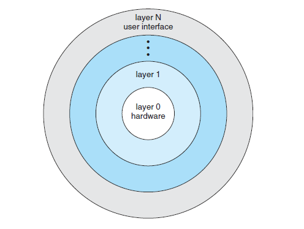
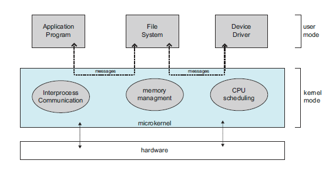

> Nama : Julita Hasanah 
> Nim : 2110131120005

  

<h1 align="center"><b>Struktur Sistem Operasi</b></h1>

Sebuah sistem yang besar dan kompleks seperti sistem operasi modern harus diatur dengan cara membagi task kedalam komponen-komponen kecil agar dapat berfungsi dengan baik dan mudah dimodifikasi. Pada bab ini, kita akan membahas cara komponen-komponen ini dihubungkan satu sama lain.

 

## **Struktur Sederhana**

Pada struktur ini, sistem operasi komputer dibuat dari sekumpulan prosedur, yang mana setiap prosedur itu dapat memanggil prosedur yang lainnya, kapan pun prosedur di perlukan. Pada struktur sederhana tidak ada pemisahan yang jelas antara aplikasi dan sistem operasi akibatnya program-program malware mudah memodifikasi dan merusak sistem operasi. Program aplikasi memiliki akses untuk memodifikasi bagian sistem operasi.
 

 

Gambar 1 Struktur Monolitic

Penjelasan lapisan gambar di atas

- Main Procedure adalah suatu program yang digunakan untuk memanggil salah satu dari service prosedures, dan juga meminta pelayanan dari service procedures.

- Service Prosedures adalah program yang diginakan untuk menjalankan fungsi pemanggilan procedures yang mana procedures itu harus di aktifkan.

- Utility Procedures adalah program dasar yang digunakan untuk mengendalikan sistem komputer dan juga untuk mengerjakan apa yang dibutuhkan oleh service procedures.

Contoh Sistem operasi yang menggunakan struktur ini adalah : UNIX , MS-DOS

 

Gambar 2 Struktur MS-DOS dan Struktur UNIX

MS-DOS, UNIX awalnya dibatasi oleh fungsionalitas perangkat keras. Ini terdiri dari dua bagian yang dapat dipisahkan: kernel dan program sistem. Kernel selanjutnya dipisahkan menjadi serangkaian antarmuka dan driver perangkat, yang telah ditambahkan dan diperluas selama bertahun-tahun seiring perkembangan UNIX. Kita dapat melihat sistem operasi UNIX tradisional sebagai berlapis sampai batas tertentu, seperti yang ditunjukkan pada Gambar diatas Segala sesuatu di bawah antarmuka panggilan sistem dan di atas perangkat keras fisik adalah kernel. Kernel menyediakan sistem file, penjadwalan CPU, manajemen memori, dan fungsi sistem operasi lainnya melalui panggilan sistem. Singkatnya, itu adalah sejumlah besar fungsi untuk digabungkan menjadi satu tingkat. Struktur monolitik ini sulit untuk diterapkan dan dipelihara. Namun, ia memiliki keunggulan kinerja yang berbeda: hanya ada sedikit overhead di antarmuka panggilan sistem atau dalam komunikasi di dalam kernel. Kami masih melihat bukti struktur monolitik sederhana ini di sistem operasi UNIX, Linux, dan Windows.
 

### **Keunggunlan**

- layanan dapat dilakukan sangat cepat karena terdapat di satu ruang alamat.

### **Kelemahan**

- Pengujian dan penghilangan kesalahan sulit karena tidak dapat dipisahkan dan dialokassikan.
- Sulit dalam menyediakan fasilitas pengamanan.
- Merupakan pemborosan bila setiap komputer harus mejalankan kerlel monolitik sangat besar smentara sbenarnya tidak memerlukan seluruh layanan yang disediakan kernel.
- Kesalahan pemrograman satu bagian dari kernel menyebabkan matinya seluruh sistem.

  

## **Sistem Berlapis (Layered)**

Dengan dukungan perangkat keras yang tepat, sistem operasi dapat dipecah menjadi bagian-bagian yang lebih kecil dan lebih sesuai daripada yang diizinkan oleh sistem MS-DOS dan UNIX asli. Sistem operasi dibentuk secara hirarki berdasar lapisan — lapisan, dimana lapisan-lapisan bawah memberi layanan lapisan lebih atas. Lapisan yang paling bawah adalah bertugas menanngani ditil operasi perangkat keras dan yang paling tinggi menangani user- interface atau aplikasi.Rutin-rutin pada suatu lapisan hanya boleh menggunakan rutin-rutin lapisan bawahnya. Sebuah lapisan adalah implementasi dari obyek abstrak yang merupakan enkapsulasi dari data dan operasi yang bisa memanipulasi data tersebut. Struktur berlapis dimaksudkan untuk mengurangi kompleksitas rancangan dan implementasi sistem operasi. Contoh sistem operasi yang menggunakan sistem ini adalah: UNIX termodifikasi, THE, Venus dan OS/2.  

Gambar 3 Sistem Operasi Berlapis.

 

Lapisan sistem operasi adalah implementasi dari objek abstrak yang terdiri dari data dan operasi yang dapat memanipulasi data tersebut.  
Keuntungan utama dari pendekatan berlapis adalah kesederhanaan konstruksi dan debugging. Setiap lapisan diimplementasikan hanya dengan operasi yang disediakan oleh lapisan tingkat yang lebih rendah. Sebuah layer tidak perlu mengetahui bagaimana operasi ini diimplementasikan; ia hanya perlu mengetahui apa yang dilakukan operasi-operasi ini. Oleh karena itu, setiap lapisan menyembunyikan keberadaan struktur data, operasi, dan perangkat keras tertentu dari lapisan tingkat yang lebih tinggi.  
Kesulitan utama dengan pendekatan berlapis melibatkan tepat mendefinisikan berbagai lapisan. Karena sebuah lapisan hanya dapat menggunakan lapisan tingkat yang lebih rendah, perencanaan yang cermat diperlukan. Misalnya, driver perangkat untuk penyimpanan cadangan (ruang disk yang digunakan oleh algoritme memori virtual) harus berada pada tingkat yang lebih rendah daripada rutinitas manajemen memori, karena manajemen memori memerlukan kemampuan untuk menggunakan penyimpanan cadangan.  
Masalah terakhir dengan implementasi berlapis adalah bahwa mereka cenderung kurang efisien daripada jenis lainnya. Misalnya, ketika program pengguna menjalankan operasi I/O, program tersebut mengeksekusi panggilan sistem yang terperangkap ke lapisan I/O, yang memanggil lapisan manajemen memori, yang pada gilirannya memanggil lapisan penjadwalan CPU, yang kemudian diteruskan ke perangkat keras. Pada setiap lapisan, parameter dapat dimodifikasi, data mungkin perlu diteruskan, dan seterusnya. Setiap lapisan menambahkan overhead ke panggilan sistem. Hasil akhirnya adalah panggilan sistem yang membutuhkan waktu lebih lama daripada yang dilakukan pada sistem tidak berlapis.  
Keterbatasan ini telah menyebabkan reaksi kecil terhadap layering dalam beberapa tahun terakhir. Lebih sedikit lapisan dengan lebih banyak fungsionalitas sedang dirancang, memberikan sebagian besar keuntungan dari kode termodulasi sambil menghindari masalah definisi lapisan dan interaksi.
 

### **Lapisan Sistem Operasi Secara Umum** 

 
 

### **Keuntungan :**

- Mempermudah dubug dan verifikasi sistem
- Lapisan pertama bisa didebug tanpa menggangu sistem yang lain

 

### **Kesulitan :**

- hanya bisa menggunakan lapisan dibawahnya
- Tidak efisien dibandingkan tipe yang lain

  

## **Kernel Mikro**

Mikrokernel adalah inti OS kecil yang menyediakan dasar untuk modular extensesi. Metode ini menyusun sistem operasi dengan menghapus semua komponen yang tidak esensial dari kernel, dan mengimplementasikannya sebagai program sistem dan level pengguna. Hasilnyakernelyang lebih kecil. Pada umumnya mikrokernel mendukung proses dan menagemen memori yang minimal, sebagai tambahan utnuk fasilitas komunikasi.  
Fungsi utama mikrokernel adalah mendukung fasilitas komunikasi antara program klien dan bermacam-macam layanan yang juga berjalan diuser space. Komunikasi yang dilakukan secara tidak langsung, didukung oleh sistem message passing, dengan bertukar pesan melalui mikrokernel.  
Kita telah melihat bahwa ketika UNIX berkembang, kernel menjadi besar dan sulit untuk dikelola. Pada pertengahan 1980-an, para peneliti di Carnegie Mellon University mengembangkan sistem operasi yang disebut Mach yang memodulasi kernel menggunakan pendekatan mikrokernel. Metode ini menyusun sistem operasi dengan menghapus semua komponen yang tidak penting dari kernel dan mengimplementasikannya sebagai sistem dan program tingkat pengguna. Hasilnya adalah kernel yang lebih kecil. Ada sedikit konsensus mengenai layanan mana yang harus tetap berada di kernel dan mana yang harus diimplementasikan di ruang pengguna. Biasanya, bagaimanapun, mikrokernel menyediakan proses minimal dan manajemen memori, selain fasilitas komunikasi. Gambar 4 mengilustrasikan arsitektur mikrokernel tipikal.

 

Gambar 4 Arsitektur mikrokernel tipikal.

 

Salah satu manfaat dari pendekatan mikrokernel adalah membuat perluasan sistem operasi menjadi lebih mudah. Semua layanan baru ditambahkan ke ruang pengguna dan akibatnya tidak memerlukan modifikasi kernel. Ketika kernel memang harus dimodifikasi, perubahannya cenderung lebih sedikit, karena mikrokernel adalah kernel yang lebih kecil. Sistem operasi yang dihasilkan lebih mudah untuk dipindahkan dari satu desain perangkat keras ke desain perangkat keras lainnya. Mikrokernel juga memberikan lebih banyak keamanan dan keandalan, karena sebagian besar layanan berjalan sebagai proses pengguna—bukan kernel. Jika layanan gagal, sisa sistem operasi tetap tidak tersentuh. 
 

### **Keuntungan**

- **Interface** yang seragam. Proses tidak lagi dibedakan, baik antara kernel-level maupun user-level, karena semuanya berkomunikasi via message passing.
- **Extensibility**. Bisa menambahkan fitur-fitur baru tanpa perlu melakukan kompilasi ulang
- **Flexibility**. Fitur-fitur yang sudah ada bisa dikurangi, atau dimodifikasi sesuai dengan kebutuhan sehingga menjadi lebih efisien. Misalnya tidak semua pengguna membutuhkan security yang sangat ketat, atau kemampuan untuk melakukan distributed computing.
- **Portability**. Pada mikro kernel, semua atau sebagian besar kode yang prosesor-spesifik berada di dalamnya. Jadi, proses porting ke prosesor lain bisa dilakukan dengan relatif sedikit usaha. Pada kelompok desktop misalnya, tampaknya dominasi Intel makin kuat. Tapi, sampai seberapa lama itu bisa bertahan? Karena itulah, portability adalah salah satu isu yang sangat penting.
- **Reliability**. Semakin besar suatu software, maka tentulah semakin sulit untuk menjamin reliabilitynya. Desain dengan pendekatan berlapis sangatlah membantu, dan dengan pendekatan mikro kernel bisa lebih lagi. Mikro kernel dapat diuji secara ekstensif karena dia menggunakan API yang sedikit,sehingga bisa meningkatkan kualitas code di luar kernel.
- **Support for object-oriendted OS**. Model mikro kernel sangat sesuai untuk mengembangkan sistem operasi yang berbasis object-oriented. Contoh sistem operasi yang menggunakan mikro kernel adalah Mac OS X dan QNX.

 

### **Kinerjanya Mikrokernel**

Dalam teorinya, sistem operasi yang menggunakan microkernel disebut jauh lebih stabil dibandingkan dengan monolithic kernel, karena sebuah server yang gagal bekerja, tidak akan menyebabkan kernel menjadi tidak dapat berjalan, dan server tersebut akan dihentikan oleh kernel utama. Akan tetapi, dalam prakteknya, bagian dari system state dapat hilang oleh server yang gagal bekerja tersebut, dan biasanya untuk melakukan proses eksekusi aplikasi pun menjadi sulit, atau bahkan untuk menjalankan server-server lainnya. Sistem operasi yang menggunakan microkernel umumnya secara dramatis memiliki kinerja di bawah kinerja sistem operasi yang menggunakan monolithic kernel. Hal ini disebabkan oleh adanya overhead yang terjadi akibat proses input/output dalam kernel yang ditujukan untuk mengganti konteks (context switch) untuk memindahkan data antara aplikasi dan server. Beberapa sistem operasi yang menggunakan microkernel:

- IBM AIX, sebuah versi UNIX dari IBM
- Amoeba, sebuah kernel yang dikembangkan untuk tujuan edukasi
- Kernel Mach, yang digunakan di dalam sistem operasi GNU/Hurd, NexTSTEP, OPENSTEP, dan Mac OS/X
- Minix, kernel yang dikembangkan oleh Andrew Tanenbaum untuk tujuan
  edukasi
- Symbian OS, sebuah sistem operasi yang populer digunakan pada hand phone, handheld device, embedded device, dan PDA Phone.

 

<b>Struktur Sistem Operasi Berbasis Mikrokernel monolitik</b>

 

 

### **Rancangan Mikrokernel**

Pada pembahasan “Struktur Sederhana”, sempat disinggung istilah “kernel”. Kernel adalah komponen sentral dari sistem operasi. Ia mengatur hal-hal seperti interrupt handler(untuk menyediakan layanan interupsi), process scheduler(membagi-bagi proses dalam prosesor), memory management, I/O, dan sebagainya. Atau dengan kata lain, ia adalah jembatan antara hardware dengan software. Cara tradisional untuk membangun sistem operasi adalah dengan membuat kernel monolitis, yaitu semua fungsi disediakan oleh kernel, dan ini menjadikan kernel suatu program yang besar dan kompleks.  
Cara yang lebih modern, adalah dengan menggunakan kernel mikro. Pada awalnya, konsep mikro kernel dikembangkan pada sistem operasi Mach. Ide dasar dari pengembangan kernel mikro adalah bahwa hanya fitur-fitur yang perlu saja yang diimplementasikan dalam kernel (mengenai fitur-fitur apa saja yang perlu diimplementasikan, ini bisa berbeda tergantung desain sistem operasi).  
Walaupun garis pembatas mengenai apa saja yang berada di dalam dan luar kernel mikro bisa berbeda antara desain yang satu dengan yang lain, namun ada karakteristik yang umum, yaitu servis-servis yang umumnya menjadi bagian sistem operasi menjadi subsistem eksternal yang bisa berinteraksi satu sama lain dan dengan kernel tentunya. Ini mencakup device driver, file system, virtual memory manager, windowing system, dan security devices. Pendekatan kernel mikro menggantikan pendekatan berlapis yang vertikal tradisional.  
Komponen-komponen sistem operasi yang berada di luar kernel mikro diimplementasikan sebagai server process dan berkomunikasi dengan message passing via kernel mikro. Misalnya jika user ingin membuat berkas baru, dia mengirim pesan ke file system server, atau jika ingin membuat proses baru, dia mengirimkan pesan ke process server.

